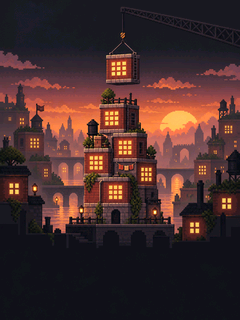

  <a href="README.zh_CN.md">简体中文</a> · <strong>English</strong>

# Tower Bloxx for FoloToy AI Passport

Build a skyline one floor at a time. A square floor swings across the screen; press **OK** at the right moment to drop it onto the tower. A well-timed drop keeps the building steady, while a miss makes the next floor harder to place.

## Play

- **Quick Game:** Keep stacking and chase a higher score.
- **City Mode:** Complete towers, place them on a 4 × 4 city map, and grow the skyline.
- **UP / DOWN:** Move through the menu and city choices.
- **OK:** Select an option or drop a floor.
- **Hold OK:** Return to the game title.
- **Theme:** Choose the dusk or daylight look on the title screen. The choice is saved.

The game includes an original pixel-city cover, matching gameplay backgrounds, a looping chiptune soundtrack, and distinct cues for successful drops, perfect timing, misses, and results. It opens directly into the game after a short loading screen.

This repository contains the full game source and artwork, based on the [FoloToy AI Passport](https://github.com/FoloToy/ai-passport) project. For build and validation instructions, see the [engineering guide](docs/development/engineering/build-and-test.md). Generated firmware files are intentionally excluded from Git. The source repository is licensed under [MIT](LICENSE).
